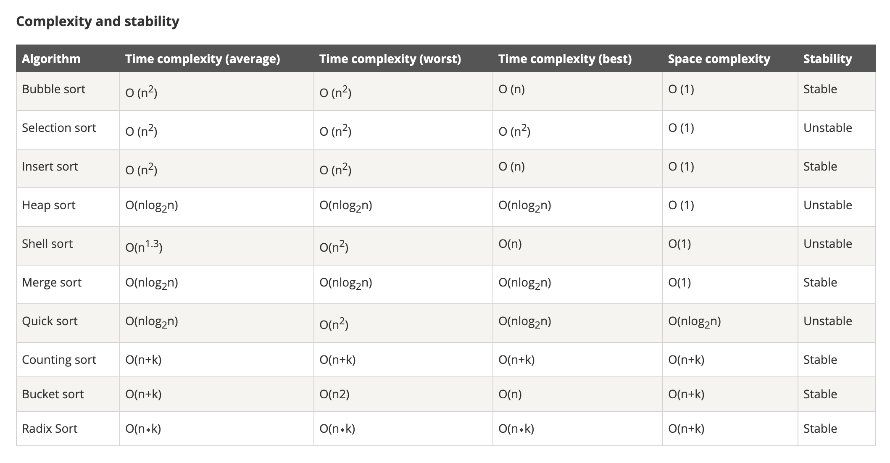

# 排序算法集合
* **Ordenamiento**
  * `P` [Ordenamiento de Burbuja](src/algorithms/sorting/bubble-sort)
  * `P` [Ordenamiento por Selección](src/algorithms/sorting/selection-sort)
  * `P` [Ordenamiento por Inserción](src/algorithms/sorting/insertion-sort)
  * `P` [ Ordenamiento en Pilas](src/algorithms/sorting/heap-sort)
  * `P` [Ordenamiento por Fusion](src/algorithms/sorting/merge-sort)
  * `P` [Quicksort](src/algorithms/sorting/quick-sort) - implementaciones in situ y no in situ
  * `P` [Shellsort](src/algorithms/sorting/shell-sort)
  * `P` [Clasificación de Recuento](src/algorithms/sorting/counting-sort)
  * `P` [Ordenamiento Radix](src/algorithms/sorting/radix-sort)

#### 复杂度和稳定性

## Refs
- [Implementation For The Sort Algorithms In Golang](https://www.tutorialdocs.com/article/golang-sort-algorithms.html)
- [javascript-algorithms](https://github.com/trekhleb/javascript-algorithms)